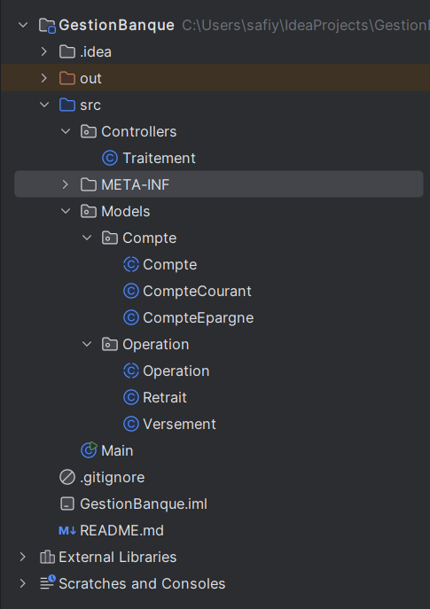
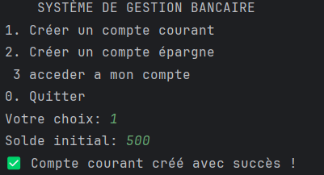
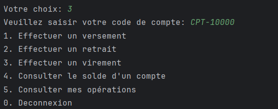

# GestionBanqueJava
Une application console Java 8 développée selon l'architecture MVC pour automatiser la gestion des comptes bancaires et leurs opérations.
## Aperçu
Ce projet implémente un système de gestion bancaire permettant de gérer deux types de comptes (courant et épargne) avec leurs opérations associées (versements, retraits, virements). L'application utilise une interface console interactive et respecte les principes de l'architecture MVC.
## Fonctionnalités
✅ Création de comptes courants avec découvert autorisé  
✅ Création de comptes épargne avec taux d'intérêt  
✅ Génération automatique de codes de compte (format: CPT-XXXXX)  
✅ Authentification par code de compte
## Opérations Bancaires
✅ Versements avec source (salaire, virement externe, dépôt espèces)  
✅ Retraits avec destination (ATM, chèque, virement sortant)  
✅ Virements entre comptes avec validation des soldes  
✅ Consultation de solde et détails du compte  
✅ Historique complet des opérations
## Interface Utilisateur
✅ Menu principal avec navigation hiérarchique  
✅ Sous-menu personnalisé après authentification  
✅ Messages d'information et d'erreur clairs  
✅ Validation des entrées utilisateur en temps réel  
## Architecture

## Technologies Utilisées
* Java 8 - Langage de programmation  
* Java Time API - Gestion des dates et heures  
* Collections Framework - HashMap, ArrayList pour le stockage  
* UUID - Génération d'identifiants uniques  
* Regex - Validation des formats  
* Scanner - Interface utilisateur console  
## Installation et Exécution
* Java 8 ou version supérieure  
* Un IDE Java (Eclipse, IntelliJ IDEA, VS Code) ou un terminal  
# Compilation
```bash
  javac GestionBanque.java
````
# Exécution
```bash
 java GestionBanque
```
## Utilisation
# Menu 

# sous menu

